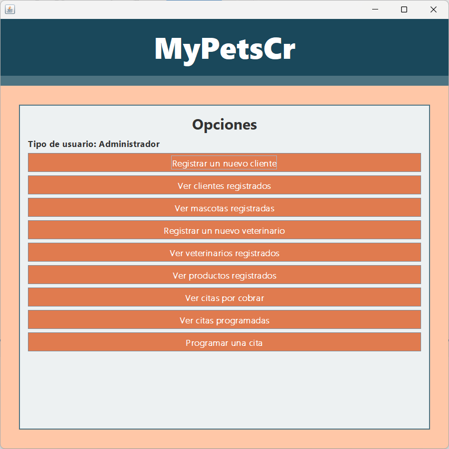
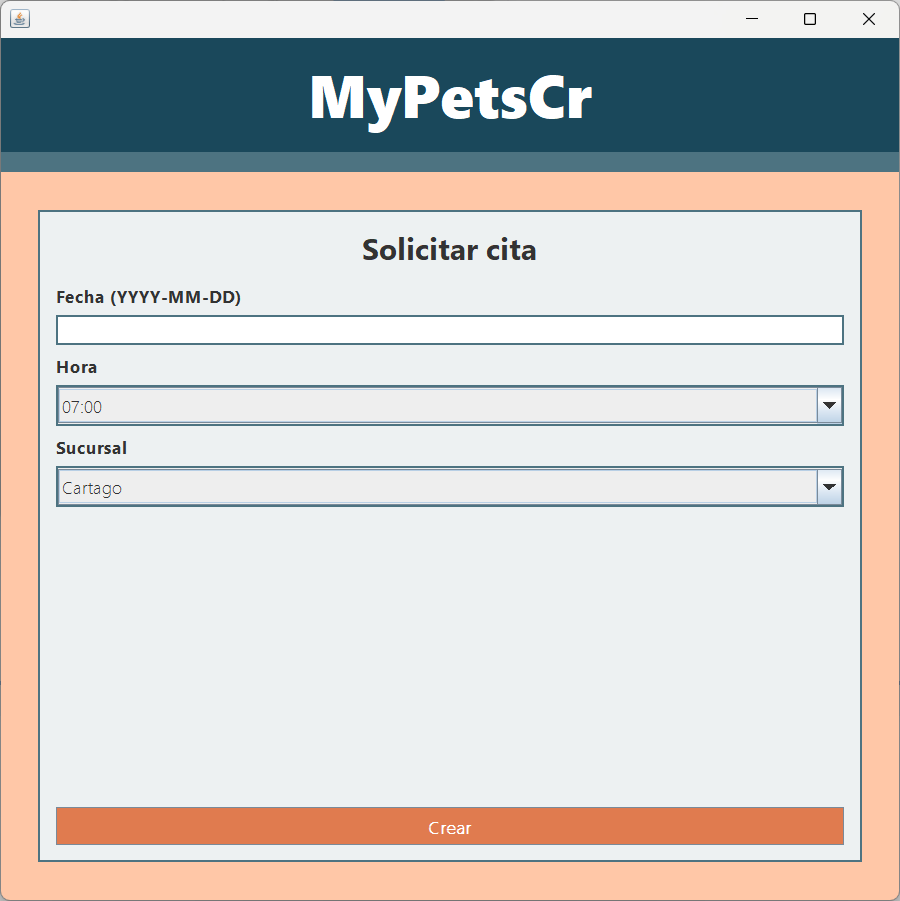
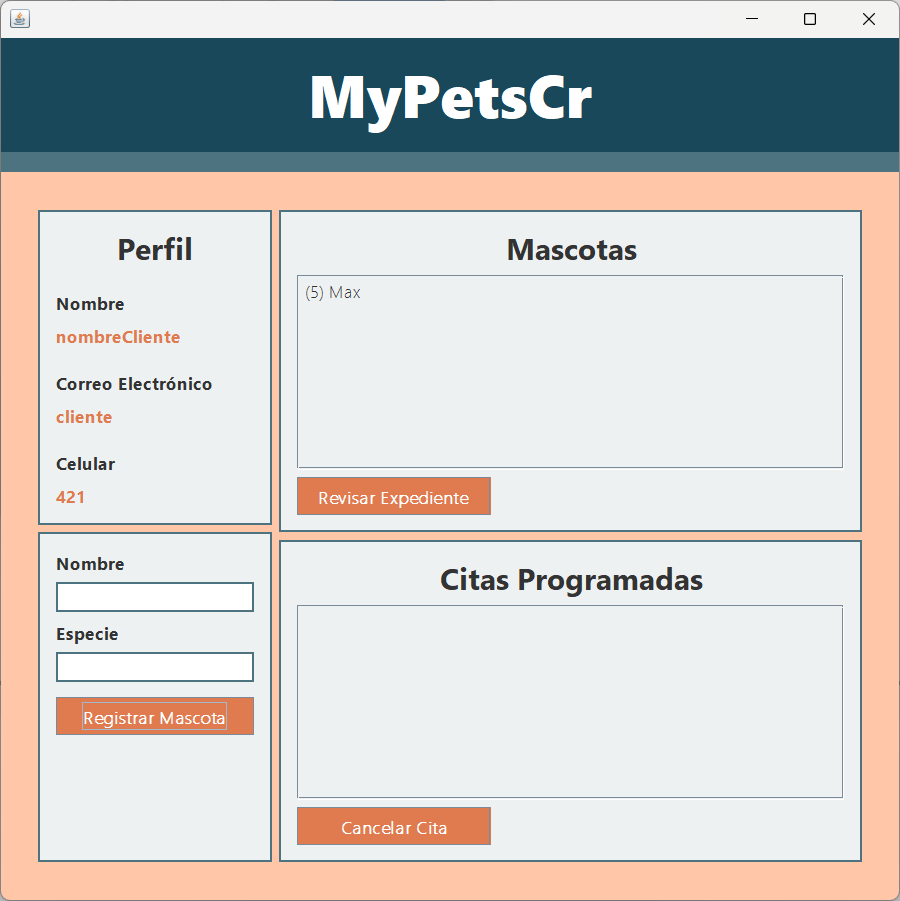
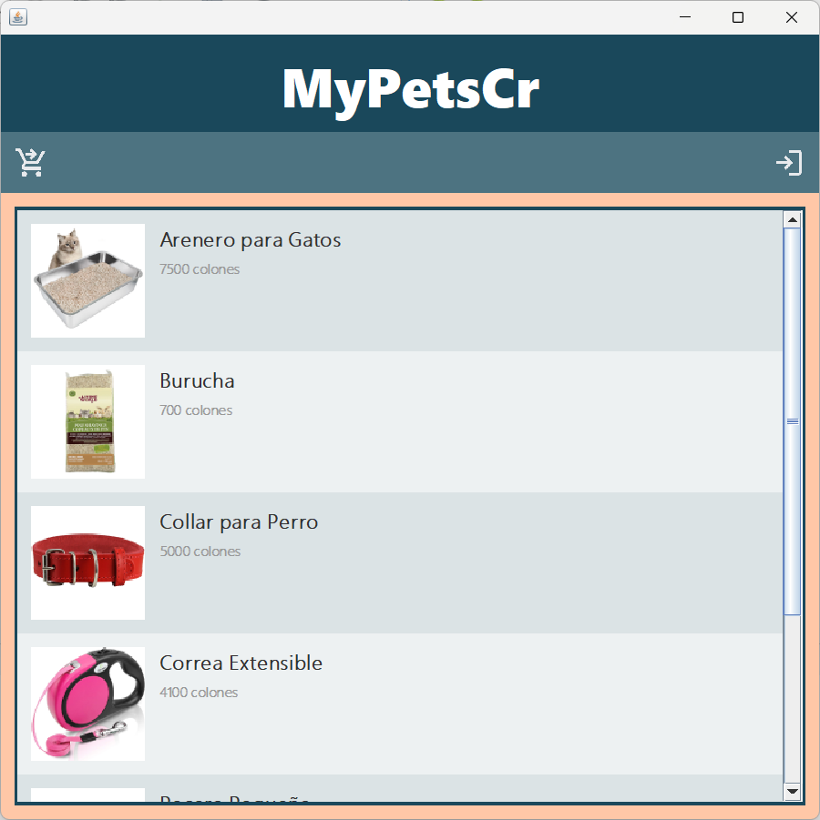
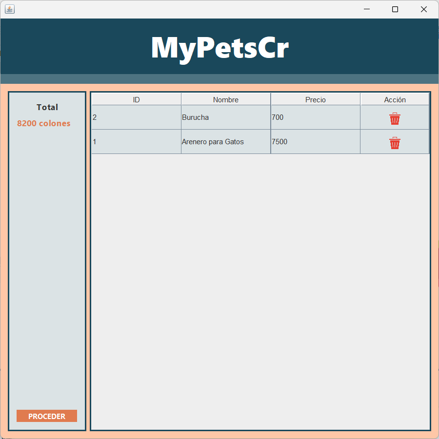
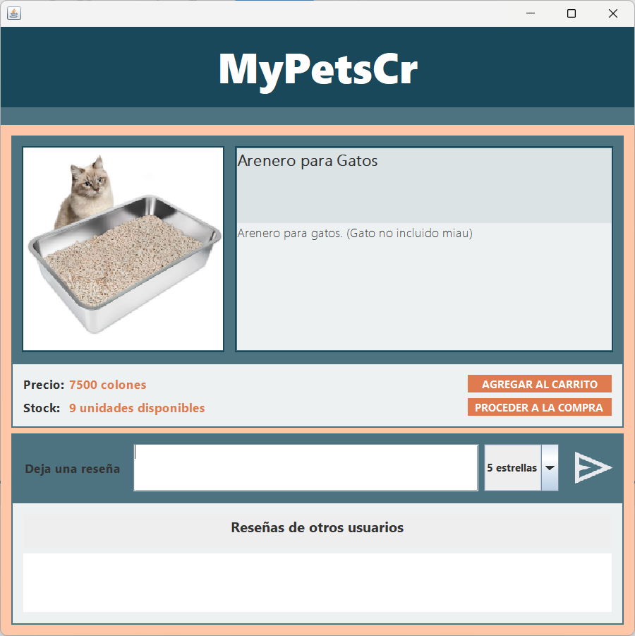
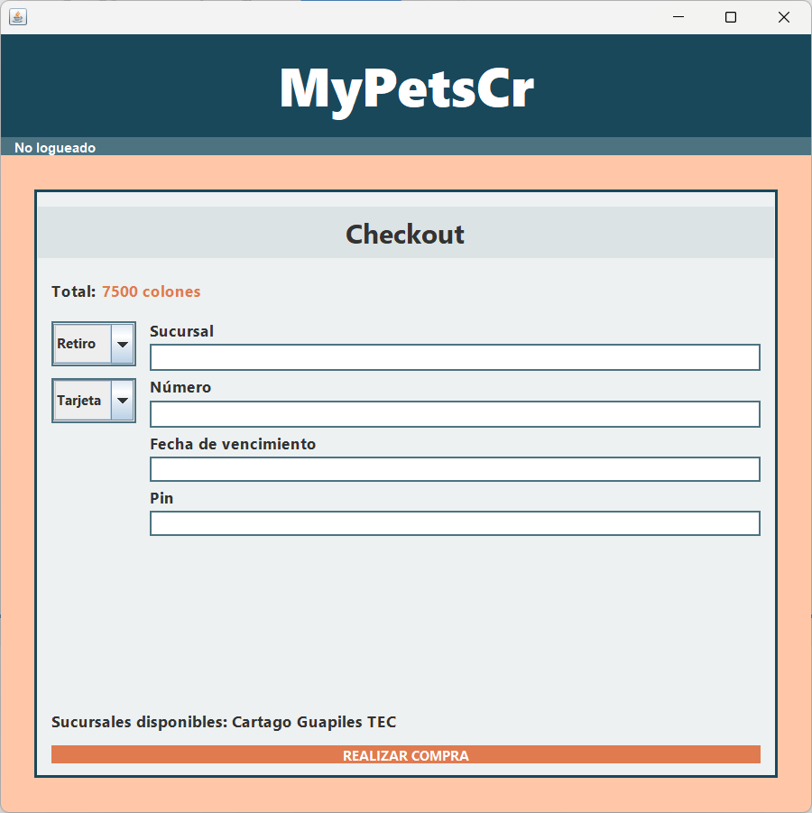

# MyPetCr
Proyecto final para el curso de Bases de Datos I.

## Introducción

MyPetCR es una aplicación diseñada para una cadena de veterinarias que busca manejar diversos procesos de su negocio mediante el uso de bases de datos relacionales. El proyecto tiene como objetivo centralizar la gestión de pacientes, citas, ventas de productos y servicios, ofreciendo una solución integral para clientes y veterinarios.

Este proyecto utiliza Java y MSSQL para funcionar.

### Características principales

1. **Gestión de usuarios**:
   - Múltiples tipos de usuarios: clientes, veterinarios, administradores.
   - Capacidad de compra sin iniciar sesión.
   - Mecanismo de autenticación para garantizar el acceso seguro.

2. **Gestión de citas**:
   - Programación de citas por parte de los clientes.
   - Administración y documentación de citas por parte de los veterinarios.
   - Cobro de productos y servicios asociados a cada cita.

3. **Expediente médico de pacientes**:
   - Creación y mantenimiento de historiales médicos de las mascotas.
   - Registro de eventos médicos agregados por los veterinarios.

4. **Funcionalidad de e-commerce**:
   - Venta de productos a través de la misma aplicación.
   - Carrito de compras para facilitar la adquisición de productos y servicios.  

  
  

5. **Interacción cliente-veterinario**:
   - Los dueños de mascotas pueden consultar sus citas y el expediente médico de sus mascotas.
